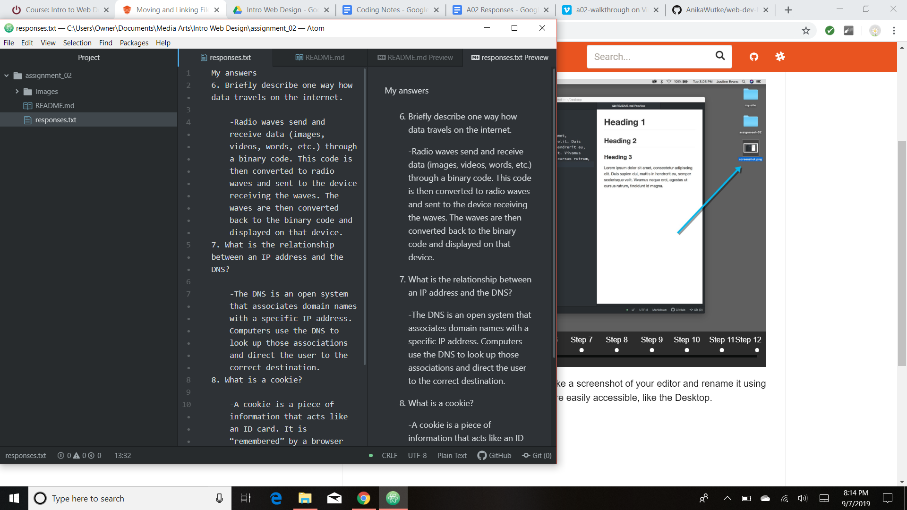

# Assignment 2
## Anika Wutke
I am taking this class in part because it is a requirement for the BFA. However, I found myself interested in the design side of web development last semester in the photoshop art and design class. This last summer also got me interested in coding when I was working on content for my office’s website and had to wait for the one person who knew code to officially change anything. I would love to add the skill of at least basic coding to my repertoire.

1. I would like to end this class with basic coding abilities.
2. I would like to know how to make a functioning website.
2. By the end of this class, I would like to know enough to be able to communicate my ideas of design clearly.

[Pinterest](https://www.pinterest.com/)

[Assignment 2 Responses](./responses.txt)

