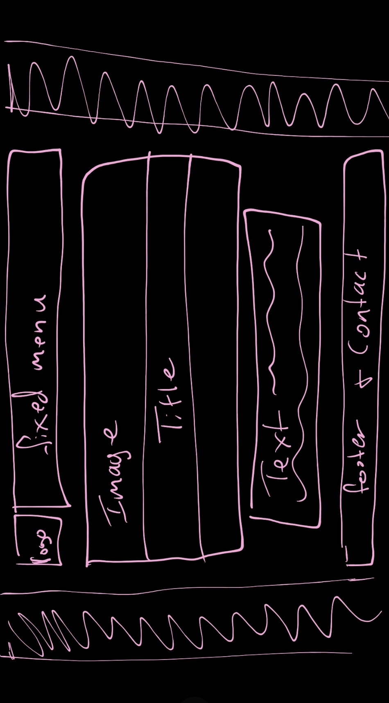

1. What is the difference between padding, margin, and borders?

    Padding is the amount of space between the main content of and element and its border.

    Margin is the amount of space between the element and other elements or the edge of the parent element. I think of it as the amount of space from the edge of the frame and an element itself.

    Borders directly surround an element and defines the line where it ends. Sometimes there is no thick border, or one present at all, but the element's edges are still present and thus, so is the border.

2. Embed the image of your sketch.
    

3. Free Response: Summarize your work cycle for this assignment.

    I had a really hard time getting started with this project. I knew I wanted to attempt my own version of the website of the place I worked at this summer. Their colors are green and white, so that made it easy for me to decide on a color palette. When I first read through the website, I thought I understood what I needed to do and wouldn't have such a difficult time implementing the code described. I ended up having a really hard time with the menu and look forward to learning an actual navigation element in the future. For some reason, I also had a hard time making everything centered on the page and don't quite know how to fix it. It is a moldable layout, however, and it is at least a starting point going forward. 
